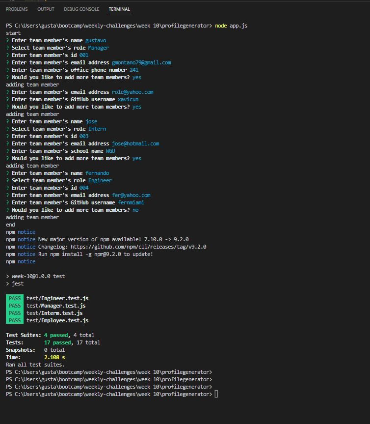

# Team-Profile-Generator

Object-Oriented Programming Challenge

# Project Description

This project is a Team profile generator. which can be use to add employees information, assigned to a specific role and then generated an HTML document that will show cards for each of the team member with their respective information.

A screen capture of an example user input is shown below:

A screenshot of an example team profile is shown below:

## Installation

To run this app you need to install INQUIRER and FS dependencies, and Express. Plus for testing purposes Jest was used.

## Usage

To use this app you need to run it from the TERMINAL using the comand node app.js

## Deployment application link

Google drive: https://drive.google.com/file/d/1lLGiuv5P2tE6jSFNIV9pDQRGRpUMlAF2/view

Youtube Video: https://youtu.be/jmIIObqdh7A
